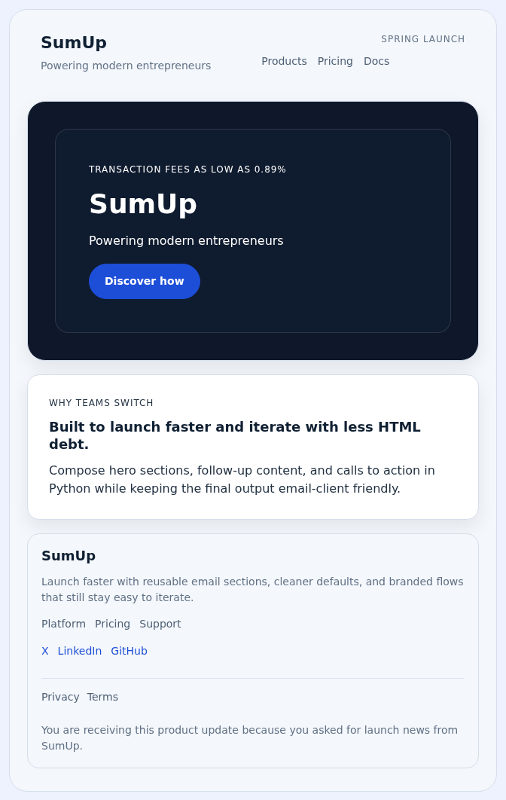
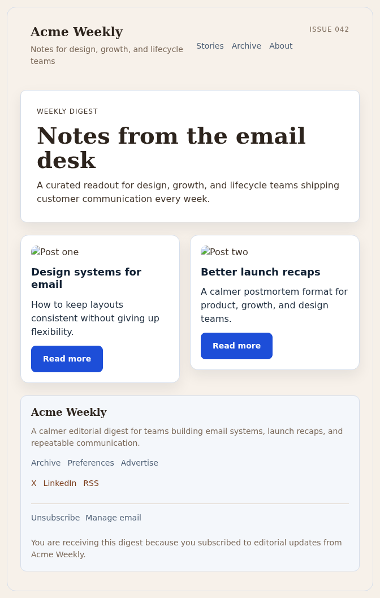
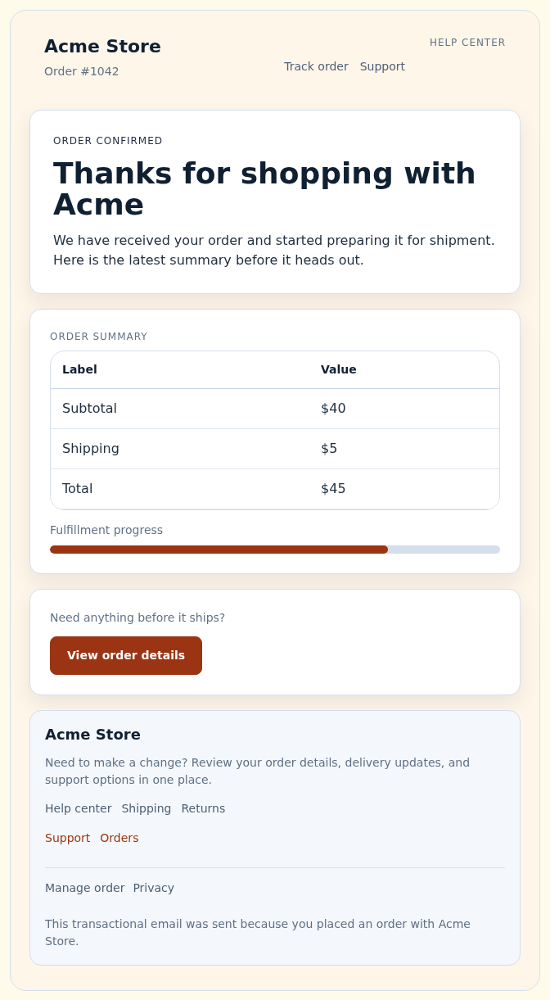

# pyzahidal

Composable Python components for building HTML emails without hand-maintaining large table templates.

`pyzahidal` gives you reusable sections, primitives, starter templates, and theme presets so you can build polished email layouts from Python and still keep Jinja placeholders intact when you need them.

[Documentation](https://d-nyamkhuu.github.io/pyzahidal/) • [Examples](https://d-nyamkhuu.github.io/pyzahidal/generated/examples/) • [Quickstart](https://d-nyamkhuu.github.io/pyzahidal/quickstart/)

## Why use it

- Compose emails from sections and primitives instead of editing raw HTML tables by hand
- Keep template expressions with `raw()`, `jinja()`, and `render_template()`
- Reuse themes and layout building blocks across launch, editorial, promo, and commerce emails
- Start from high-level templates when they fit, then drop down to components when you need more control

## What it can build

### Product launch / hero layout



Use `EmailDocument` with reusable sections and primitives to build a branded launch email without dropping into hand-written markup.

```python
from pyzahidal import (
    Button,
    EmailDocument,
    Footer,
    Header,
    Heading,
    Inline,
    MenuItemSpec,
    SocialLinkSpec,
    Stack,
    Surface,
    Text,
)

email = EmailDocument(
    title="SumUp launch update",
    preview_text="Transaction fees as low as 0.89% for modern entrepreneurs.",
    theme="modern",
    sections=[
        Header(
            "SumUp",
            [
                MenuItemSpec("Products", href="#products"),
                MenuItemSpec("Pricing", href="#pricing"),
                MenuItemSpec("Docs", href="#docs"),
            ],
            tagline="Powering modern entrepreneurs",
            meta_label="Spring launch",
            theme="modern",
        ),
        Surface(
            Surface(
                Stack(
                    Text("Transaction fees as low as 0.89%", size="kicker", tone="inverse"),
                    Heading("SumUp", level="hero", tone="inverse"),
                    Text("Powering modern entrepreneurs", tone="inverse"),
                    Inline(Button("Discover how", href="#")),
                    gap="18px",
                ),
                tone="overlay",
                padding="44px",
                radius="18px",
            ),
            background_image="https://images.example.com/sumup-hero.jpg",
            background_color="#0f172a",
            padding="36px",
            radius="24px",
        ),
        Surface(
            Stack(
                Text("Why teams switch", size="kicker"),
                Heading("Built to launch faster and iterate with less HTML debt.", level="small"),
                Text(
                    "Compose hero sections, follow-up content, and calls to action in Python while keeping the final output email-client friendly.",
                ),
                gap="12px",
            ),
            padding="28px",
        ),
        Footer(
            "SumUp",
            [
                SocialLinkSpec(label="X", href="#x"),
                SocialLinkSpec(label="LinkedIn", href="#linkedin"),
                SocialLinkSpec(label="GitHub", href="#github"),
            ],
            description="Launch faster with reusable email sections, cleaner defaults, and branded flows that still stay easy to iterate.",
            menu_items=[
                MenuItemSpec("Platform", href="#platform"),
                MenuItemSpec("Pricing", href="#pricing"),
                MenuItemSpec("Support", href="#support"),
            ],
            legal_links=[
                MenuItemSpec("Privacy", href="#privacy"),
                MenuItemSpec("Terms", href="#terms"),
            ],
            disclaimer="You are receiving this product update because you asked for launch news from SumUp.",
            theme="modern",
        ),
    ],
)

html = email.render()
```

See the full example: <https://d-nyamkhuu.github.io/pyzahidal/generated/examples/#product-announcement>

### Newsletter / editorial block



Use `EmailDocument` with editorial sections to build a recurring digest that is ready to send as a full newsletter.

```python
from pyzahidal import (
    Button,
    Columns,
    EmailDocument,
    Footer,
    Header,
    Heading,
    Image,
    MenuItemSpec,
    SocialLinkSpec,
    Stack,
    Surface,
    Text,
)

email = EmailDocument(
    title="Acme editorial digest",
    preview_text="Two stories on email design systems and calmer launch recaps.",
    theme="editorial",
    sections=[
        Header(
            "Acme Weekly",
            [
                MenuItemSpec("Stories", href="#stories"),
                MenuItemSpec("Archive", href="#archive"),
                MenuItemSpec("About", href="#about"),
            ],
            tagline="Notes for design, growth, and lifecycle teams",
            meta_label="Issue 042",
            theme="editorial",
        ),
        Surface(
            Stack(
                Text("Weekly digest", size="kicker"),
                Heading("Notes from the email desk", level="hero"),
                Text(
                    "A curated readout for design, growth, and lifecycle teams shipping customer communication every week.",
                ),
                gap="12px",
            ),
            padding="28px",
        ),
        Columns(
            Surface(
                Stack(
                    Image("https://images.example.com/post-one.jpg", alt="Post one"),
                    Heading("Design systems for email", level="small"),
                    Text("How to keep layouts consistent without giving up flexibility."),
                    Button("Read more", href="#"),
                    gap="12px",
                ),
                padding="18px",
            ),
            Surface(
                Stack(
                    Image("https://images.example.com/post-two.jpg", alt="Post two"),
                    Heading("Better launch recaps", level="small"),
                    Text("A calmer postmortem format for product, growth, and design teams."),
                    Button("Read more", href="#"),
                    gap="12px",
                ),
                padding="18px",
            ),
            gap="18px",
        ),
        Footer(
            "Acme Weekly",
            [
                SocialLinkSpec(label="X", href="#x"),
                SocialLinkSpec(label="LinkedIn", href="#linkedin"),
                SocialLinkSpec(label="RSS", href="#rss"),
            ],
            description="A calmer editorial digest for teams building email systems, launch recaps, and repeatable communication.",
            menu_items=[
                MenuItemSpec("Archive", href="#archive"),
                MenuItemSpec("Preferences", href="#preferences"),
                MenuItemSpec("Advertise", href="#advertise"),
            ],
            legal_links=[
                MenuItemSpec("Unsubscribe", href="#unsubscribe"),
                MenuItemSpec("Manage email", href="#manage"),
            ],
            disclaimer="You are receiving this digest because you subscribed to editorial updates from Acme Weekly.",
            theme="editorial",
        ),
    ],
)

html = email.render()
```

See the full example: <https://d-nyamkhuu.github.io/pyzahidal/generated/examples/#newsletter-and-editorial>

### Order / transactional summary



Use `EmailDocument` with higher-level commerce sections when you want a confirmation email that is ready to send quickly.

```python
from pyzahidal import (
    Button,
    EmailDocument,
    Footer,
    Header,
    Heading,
    MenuItemSpec,
    OrderSummary,
    SocialLinkSpec,
    Stack,
    Surface,
    Text,
)

email = EmailDocument(
    title="Order confirmation",
    preview_text="Your order is confirmed and fulfillment is already underway.",
    theme="commerce",
    sections=[
        Header(
            "Acme Store",
            [
                MenuItemSpec("Track order", href="#track"),
                MenuItemSpec("Support", href="#support"),
            ],
            tagline="Order #1042",
            meta_label="Help center",
            theme="commerce",
        ),
        Surface(
            Stack(
                Text("Order confirmed", size="kicker"),
                Heading("Thanks for shopping with Acme", level="hero"),
                Text(
                    "We have received your order and started preparing it for shipment. Here is the latest summary before it heads out.",
                ),
                gap="12px",
            ),
            padding="28px",
        ),
        OrderSummary(
            [("Subtotal", "$40"), ("Shipping", "$5"), ("Total", "$45")],
            progress=75,
        ),
        Surface(
            Stack(
                Text("Need anything before it ships?", size="small", tone="muted"),
                Button("View order details", href="#"),
                gap="12px",
            ),
            padding="24px",
        ),
        Footer(
            "Acme Store",
            [
                SocialLinkSpec(label="Support", href="#support"),
                SocialLinkSpec(label="Orders", href="#orders"),
            ],
            description="Need to make a change? Review your order details, delivery updates, and support options in one place.",
            menu_items=[
                MenuItemSpec("Help center", href="#help"),
                MenuItemSpec("Shipping", href="#shipping"),
                MenuItemSpec("Returns", href="#returns"),
            ],
            legal_links=[
                MenuItemSpec("Manage order", href="#manage-order"),
                MenuItemSpec("Privacy", href="#privacy"),
            ],
            disclaimer="This transactional email was sent because you placed an order with Acme Store.",
            theme="commerce",
        ),
    ],
)

html = email.render()
```

See the full example: <https://d-nyamkhuu.github.io/pyzahidal/generated/examples/#ecommerce-and-order-flows>

## First document

```python
from pyzahidal import ActionSpec, EmailDocument, Hero

email = EmailDocument(
    preview_text="Composable emails with Jinja-friendly output",
    sections=[
        Hero(
            eyebrow="Launch week",
            title="Build emails from reusable sections",
            body="Start with a document shell, add sections, then customize only what you need.",
            primary_action=ActionSpec("Explore docs", href="https://d-nyamkhuu.github.io/pyzahidal/"),
        )
    ],
)

html = email.render()
```

`html` is a complete HTML email document.

## Install

From PyPI:

```bash
pip install pyzahidal
```

From a checkout:

```bash
pip install -e .
```

Or run directly from the repository:

```bash
PYTHONPATH=src python your_script.py
```

## Composition vs templates

Use `EmailDocument` plus sections and primitives when you want to control layout directly.

Use starter templates like `MarketingTemplate`, `NewsletterTemplate`, `PromoTemplate`, `OrderTemplate`, or `ProductAnnouncementTemplate` when you want a faster starting point and only need to customize parts of the flow.

When you want template expressions preserved, use `raw()`, `jinja()`, and `render_template()`.

## Documentation

- Docs home: <https://d-nyamkhuu.github.io/pyzahidal/>
- Quickstart: <https://d-nyamkhuu.github.io/pyzahidal/quickstart/>
- Core Concepts: <https://d-nyamkhuu.github.io/pyzahidal/core-concepts/>
- Recipes: <https://d-nyamkhuu.github.io/pyzahidal/recipes/>
- Examples gallery: <https://d-nyamkhuu.github.io/pyzahidal/generated/examples/>
